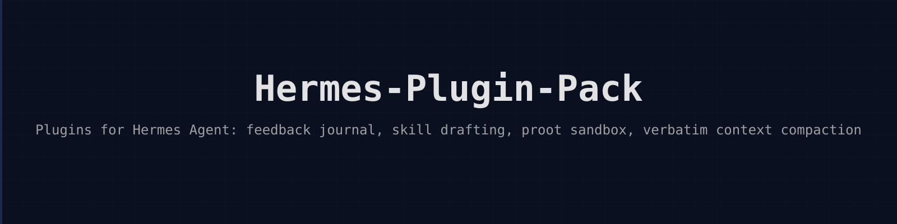

# Hermes-Plugin-Pack

_Русская версия: [README.ru.md](README.ru.md)_

[](https://opensource.org/licenses/MIT)
[](https://python.org)
[](https://pypi.org/project/hermes-plugin-pack/)
[](.github/workflows/tests.yml)

<p align="center"></p>

## Overview

Hermes-Plugin-Pack provides essential plugins for Hermes Agent that enhance functionality and operational capabilities. The package contains four core plugins: feedback journaling, skill factory, proot sandbox, and verbatim context compaction. These plugins address common needs in agent operation, development, and security isolation.

## Architecture

The plugin pack follows the Hermes Agent plugin architecture with each component operating as a standalone module. The feedback journal tracks user interactions and reactions systematically. The skill factory enables rapid skill creation and iteration. The proot sandbox provides secure execution environments for untrusted code. The verbatim compaction manages context size while preserving critical details through Jev-powered selection algorithms.

Each plugin integrates with Hermes Agent's core systems through standardized interfaces. The feedback system hooks into conversation flows. The skill factory connects to the skill management system. The sandbox plugin manages containerized execution. The compaction plugin operates during context transitions.

## Features

- Feedback reaction tracking: Records user interactions and reactions in structured format for analysis and improvement
- Skill factory automation: Generates new skill templates with proper structure, tests, and documentation scaffolding
- Proot sandbox isolation: Executes untrusted code in secure containers with resource limits and filesystem isolation
- Verbatim context compaction: Reduces conversation context size while preserving essential details through intelligent selection
- Cross-platform compatibility: Works on Linux systems with proot support for sandboxing functionality
- Integrated testing framework: Includes comprehensive test suite covering all plugin functionalities

## Quick Start

Install the package and enable plugins in your Hermes Agent configuration:

```bash
pip install hermes-plugin-pack
```

Enable plugins in your Hermes configuration file by adding them to the plugins list.

## Installation

Install via pip or uv:

```bash
pip install hermes-plugin-pack
```

Or with uv:

```bash
uv pip install hermes-plugin-pack
```

Requires Python 3.11 or higher. On Linux systems, ensure proot is installed for sandbox functionality:

```bash
sudo apt-get install proot
```

## Usage

After installation, activate plugins in your Hermes Agent configuration. The feedback plugin automatically captures user reactions. The skill factory responds to creation commands. The sandbox plugin activates for code execution tasks. The compaction plugin operates during context transitions.

Example CLI usage:

```bash
# Generate a new skill
hermes skill create my_new_skill

# Execute code in sandbox
hermes safe-run "python script.py"

# View feedback logs
hermes feedback log
```

## Outputs/Artifacts

The plugins generate several types of artifacts. The feedback system creates log files in JSON format. The skill factory produces new skill files with proper structure. The sandbox creates temporary execution directories. The compaction plugin generates reduced context representations while preserving essential information.

All artifacts follow consistent naming conventions and are stored in designated directories within the Hermes workspace.

## Configuration

Configuration options for each plugin:

| Key | Type | Description |
|-----|------|-------------|
| feedback.enabled | boolean | Enable feedback reaction tracking |
| feedback.log_path | string | Path for feedback logs |
| skill_factory.template_dir | string | Directory for skill templates |
| proot.sandbox_enabled | boolean | Enable proot sandbox functionality |
| proot.max_memory | string | Memory limit for sandboxed processes |
| proot.timeout | integer | Execution timeout in seconds |
| compaction.enabled | boolean | Enable context compaction |
| compaction.target_size | integer | Target context size in tokens |

## Operational Notes

Deploy the plugin pack on systems with adequate resources for sandbox operations. Configure memory and timeout limits appropriately for your workload. Set up log rotation for feedback logs in production environments. Monitor sandbox performance and adjust limits accordingly.

The compaction plugin requires sufficient memory to process large contexts efficiently. Plan storage for generated artifacts and logs according to expected usage patterns.

## Project Scope

This project includes four functional plugins for Hermes Agent: feedback journaling, skill factory, proot sandbox, and verbatim compaction. It does not include custom models, UI components, or external service integrations beyond standard Hermes Agent interfaces. The scope excludes Windows or macOS sandboxing solutions.

## Use Cases

- Development teams using Hermes Agent who need skill templating and management
- Organizations requiring secure code execution environments for agent tasks
- Users seeking detailed feedback tracking for agent interactions
- Systems requiring context management for long-running conversations
- Teams implementing Hermes Agent in production with safety requirements

## Limitations

- Sandbox functionality limited to Linux systems with proot support
- Context compaction accuracy depends on available memory resources
- Feedback logging may generate large volumes of data in active deployments
- Some plugins require elevated privileges for full functionality
- Limited compatibility with older Python versions below 3.11

## Repository Layout

```
Hermes-Plugin-Pack/
├── plugins/
│   ├── feedback-reactions/
│   ├── skill-factory/
│   ├── proot-sandbox/
│   └── jev_compact/
├── tests/
│   ├── test_feedback_reactions.py
│   ├── test_skill_factory.py
│   ├── test_proot_sandbox.py
│   └── test_jev_compact.py
├── site/
│   └── banner.svg
├── pyproject.toml
├── README.md
├── README.ru.md
└── LICENSE
```

## Testing

Run the complete test suite with pytest:

```bash
pytest tests/
```

The test suite includes unit tests for all plugins, integration tests for cross-plugin functionality, and validation of configuration handling. Coverage includes error conditions and edge cases appropriately.

## Deployment

Install in your Hermes Agent environment using pip. Configure plugin settings according to operational requirements. Verify functionality through test commands before production deployment. Monitor resource usage and adjust configuration accordingly.

## License

MIT License. See LICENSE file for full terms.

## Disclaimer

This plugin pack extends Hermes Agent functionality. Plugin behavior depends on Hermes Agent core systems. Test thoroughly in non-production environments before deployment.
